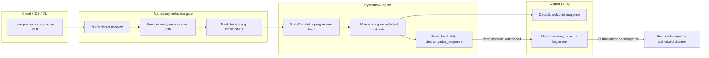

# Architecture — redaction gate and agent data flow

This document describes how user content flows through compliance-agent-skills, where PHI is masked, and how deanonymization is authorized.

## End-to-end data flow

## Components

| Component | File | Role |
|-----------|------|------|
| Entry point | `agent.py` | Orchestrates redaction → agent run → optional deanonymize |
| Redaction engine | `redaction.py` | Presidio-backed entity detection; reversible token map |
| Skills | `skills/*/SKILL.md` | Deterministic regulatory workflows (progressive disclosure) |
| Validators | `scripts/validate-*.py` | CI gates for skill structure and asset registry |

## Threat model (summary)

| Threat | Mitigation |
|--------|------------|
| Raw ePHI/PII sent to LLM provider | **Mandatory** `PHIRedactor.redact()` before `compliance_agent.run()` |
| Model reconstructs redacted values | System prompt forbids reconstruction; tokens are opaque |
| Unauthorized PHI restoration in output | `deanonymize_response` tool gated by `ComplianceDeps.deanonymize_authorized`; default `deanonymize_output=False` |
| Skill hallucination of regulations | Skills require explicit citations; validators enforce structure |
| Dependency drift affecting redaction | Locked `requirements-lock.txt`; CI runs tests + pip-audit |
| Secrets in repo | detect-secrets baseline, pre-commit, Bandit SAST |

## Deanonymization authorization

Deanonymization is **opt-in** at two layers:

1. **Run level** — `run_compliance_agent(..., deanonymize_output=True)` or `COMPLIANCE_AGENT_DEANONYMIZE=1`
2. **Tool level** — `ComplianceDeps.deanonymize_authorized` must be `True` for the `deanonymize_response` tool

Default behavior returns model output with redacted tokens intact, suitable for logs, tickets, and shared audit trails.

## CI enforcement

The redaction gate is covered by unit tests in `compliance_tests/`. CI enforces:

- Ruff lint/format on core Python
- Mypy on `agent.py`, `redaction.py`, `scripts/`
- pytest with ≥80% coverage on `agent.py` + `redaction.py`
- pip-audit, Bandit, detect-secrets, CodeQL

See [`.github/workflows/validate-and-package.yml`](../.github/workflows/validate-and-package.yml).

## Related docs

- [Redaction limitations](redaction-limitations.md) — language and entity coverage
- [SME review cadence](sme-review.md) — regulatory reference provenance
